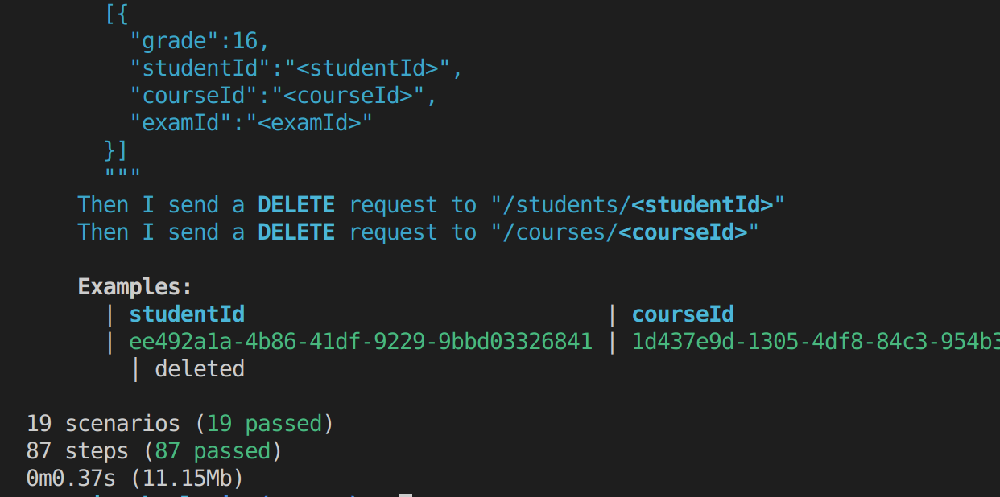
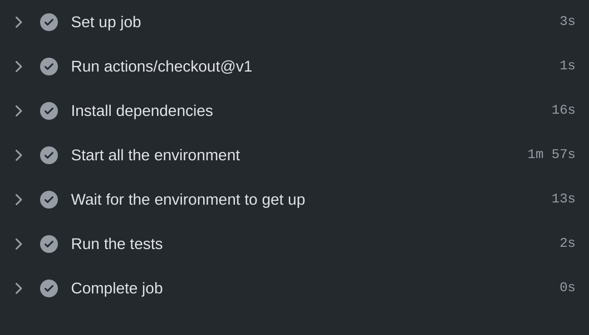

# Demo API con Symfony
Este ejemplo esta desarrollado con el paradigma de programacion Domain Driven Design DDD, para este ejemplo se tomó como dominio una escuela, despues de un análisis se obtibieron estos 5 módulos:

- Cursos
- Matrícula
- Examenes
- Evaluaciones
- Estudiantes

Estos módulos tienen alta cohesión y bajo acoplamiento, la forma de comunicación entre ellos es con CQRS y Eventos de Dominio. Para poder reutilizar código se creo un modulo Share.
```
📦src
 ┣ 📂Course
 ┣ 📂Enrollment
 ┣ 📂Exam
 ┣ 📂Grade
 ┗ 📂Student
```

El controlador y los eventos acceden a los servicios a travez de CQRS.
```
📦app
 ┣ 📂Controller
 ┃ ┣ 📜CoursesController.php
 ┃ ┣ 📜...
 ┣ 📂Event
 ┃ ┣ 📜CreateGradeOnExamCreated.php
 ┃ ┣ 📜...
```
Vamos a analizar la estructura del proyecto, los controladores y eventos estan en el nameespace APP y los modulos es en name espace School.

## Iniciar el proyecto

Para instalar las dependencias el proyecto ejecutar

```bash
make composer-install
```

Para levantar el proyecto, la primea vez va a demorar porque tiene que crear la imagen para poder correr el contenedor

```bash
make up
```

debe salir esto por consola, puede entrar a [http://localhost:8080/students](http://localhost:8080/students)

```bash
Creating school-mysql ... done
Creating school-php   ... done
```

Para correr los test

```bash
make test
```

Para detener la aplicación

```bash
make down
```

## Ejecutar las APIs

Vamos a ejecutar las url paso a paso y vamos a explicar los eventos de dominio que se estan ejecutando.

### Creando un Alumno

```bash
curl --location --request PUT 'http://localhost:8080/students/362f79da-3e71-42ec-8b45-1dec89285de9' \
--header 'Content-Type: application/json' \
--data-raw '{
    "name":"Jose Guillermo"
}'
```

Aqui creo que puede saltar una duda, ¿Por qué un put para crear un alumno, no es mejor un post?. aquí voy a intentar argumentarlo, se creó un servicio para colocar un alumno, si el alumno existe, pues, actualiza la data, y si no existe, lo crea.

### Crear un curso

Con fines de demo, cuando se registra un curso, todos los alumnos que estan registrados en la db, pasan a estar matriculados en este curso, este trabajo lo hace el modulo Enrollment, con el evento **EnrollmentStudentOnCourseCreated** 

```bash
curl --location --request PUT 'http://localhost:8080/courses/6fc897c4-d8f7-4880-8687-9642bb25c778' \
--header 'Content-Type: application/json' \
--data-raw '{
    "name":"Lenguaje"
}'
```

Aqui tambien estoy usando un PUT, y en el resto de endpoint de la demo, asi en el CRUD el Create y Update son el mismo servicio. quedaria como CRD o RUD.... XD.

### Crear un examen a un curso

Aqui también por ser una demo, se crean evaluaciones por cada alumno matriculado en ese curso, con el modulo Exam. Tambien se crea la evaluacion de alumno en el modulo Grade cuando se crea el examen con el evento **CreateGradeOnExamCreated** y pode de nota 16 a todos los laumnos

```bash
curl --location --request PUT 'http://localhost:8080/courses/6fc897c4-d8f7-4880-8687-9642bb25c778/exams/5292df5d-5e51-4ea1-bf7e-22e623ffd175' \
--header 'Content-Type: application/json' \
--data-raw '{
    "title":"Examen Final"
}'
```

### Ver las evaluaciones de un alumno

```bash
curl --location --request GET 'http://localhost:8080/students/362f79da-3e71-42ec-8b45-1dec89285de9/grades'
```

la respuesta optenida es 

```json
[
    {
        "grade": 16,
        "studentId": "362f79da-3e71-42ec-8b45-1dec89285de9",
        "courseId": "6fc897c4-d8f7-4880-8687-9642bb25c778",
        "examId": "5292df5d-5e51-4ea1-bf7e-22e623ffd175"
    }
]
```

El estudiante, curso y examen, solo regresan los ids, una forma de colocar los valores, es creando un apigateway o usar cqrs para obtener la data, el problema de este último, es que el módulo tendria alto acoplamiento a los otros modulos y sería dificil mantener el código conforme el proyecto cresca.

### Ver los examenes de un curso

```bash
curl --location --request GET 'http://localhost:8080/courses/6fc897c4-d8f7-4880-8687-9642bb25c778/exams'
```

el resultado es el siguiente

```bash
[
    {
        "id": "5292df5d-5e51-4ea1-bf7e-22e623ffd175",
        "title": "Examen Final"
    }
]
```

### Ahora vamos a desencadenar algunos Eventos de Dominio

Vamos a eliminar el curso que acabamos de crear, con esto, se van a lanzar 3 eventos en cadena, primero se van a lanzar el evento para borrar los examenes relacionados al curso **DeleteExamsOnCourseDeleted**, luego se lanza otro evento que borra las evaluaciones relacionadas a un examen **DeleteGradeOnExamDeleted**. Tambien se van a borrar las matrículas de los alumnos en ese curso **DeleteEnrollmentsOnCourseDeleted**.

```bash
curl --location --request DELETE 'http://localhost:8080/courses/6fc897c4-d8f7-4880-8687-9642bb25c778'
```

Al eliminar este curso se lanzan los eventos antes mensionados, por ser una demo, se estan borrando de la DB, en un proyecto en produccion, deberiamos cambiar de estado a las diferentes entidades.

## Test

para este demo se trabajó con DBB con la libreria Behat, el test esta en la carpeta
```
📦tests
 ┣ 📂app
 ┃ ┗ 📂features
 ┃ ┃ ┣ 📂course
 ┃ ┃ ┃ ┣ 📜create_course.feature
 ┃ ┃ ┃ ┣ 📜...
 ┃ ┃ ┣ 📂course_exam
 ┃ ┃ ┣ 📂enrollment
 ┃ ┃ ┣ 📂grade
 ┃ ┃ ┣ 📂health_check
 ┃ ┃ ┗ 📂student
```



Una demo es

```gherkin
Feature: put course
  As a user
  I want to create o update one course

  Scenario Outline: With course send correct data
    Given I send a PUT request to "/courses/<courseId>" with body:
    """
    {
      "name": "Mathematics"
    }
    """
    Then the response status code should be 201
    And the response should be empty
    And I send a GET request to "/courses/<courseId>"
    Then the response content should be:
    """
    {
      "id" : "<courseId>",
      "name" : "Mathematics"
    }
    """
    Examples:
      | courseId |
      | b6bd4625-e893-4581-8ef4-8c357ab9468b |
```

## Arquitectura hexagonal en cada módulo

Los modulos estan dentro de la carpeta src y modelan la logica de la escula, vamos a anlizar el modulo Course


- **Infraestructura**: se encarga de guardar la data en Mysql.
- **Application**: aqui estan todos nuestros casos de uso: Crear, Borrar, Buscar, los casos de uso estan implemnetados con CQRS, para que puedan ser usados desde otros lados del proyecto, desde un controlador, evento o otro caso de uso(aunque esta última forma no es muy recomendada).
- **Domain**: aqui se modelan los agregates, value object, eventos de dominio.
```
📦Course
 ┣ 📂Application
 ┃ ┣ 📂Create
 ┃ ┃ ┣ 📜CreateCourseCommand.php
 ┃ ┃ ┗ 📜CreateCourseCommandHandler.php
 ┃ ┣ 📂Delete
 ┃ ┣ 📂FindAll
 ┃ ┣ 📂 ...
 ┣ 📂Domain
 ┃ ┣ 📜Course.php
 ┃ ┣ 📜CourseCreatedDomainEvent.php
 ┃ ┣ 📜CourseDeletedDomainEvent.php
 ┃ ┗ 📜CourseRepository.php
 ┗ 📂Infrastructure
 ┃ ┗ 📂Persistence
 ┃ ┃ ┣ 📜CourseDao.php
 ┃ ┃ ┗ 📜CourseDaoRepository.php
```
## Controlador

El controlador y las clases que ejecutan los eventos de dominio estan en la carpeta app

```php
	/**
     * @Route("/{courseId}", methods={"PUT"})
     */
    public function create(string $courseId, Request $request)
    {
        $this->commandBus->dispatch(
            new CreateCourseCommand(
                $courseId,
                $request->request->get('name', '')
            )
        );
        return new Response('', Response::HTTP_CREATED);

    }
```

Los controladores mandan el Commad a Bus, con esto los controladores estan separados de los servicios, desacoplando de esta manera el controlador y los casos de uso.

## Pipe line

el código esta con Github Actions, se puede ver una demo del ultimo pase en [https://github.com/jguillermo/api-school/actions](https://github.com/jguillermo/api-school/actions)



## ¿Por qué trabajar de esta forma?

Es verdad que al inicio trabajar de esta forma toma más tiempo el desarrollar las aplicaciones, pero la flexibilidad e independencia que se logra, es para que este propyecto pueda crecer en el tiempo y no tener que pensar en reescribir la aplicaion porque ya se volvió imposible de mantener. Pero calma, hay una forma de trabajar de esta forma y aun asi obtener tiempos cortos en el desarrollo, hay una herramienta que genera código [https://www.npmjs.com/package/@cafeta/cli](https://www.npmjs.com/package/@cafeta/cli) lo he desarrollado hace algunos meses, pues bien ahora esta generando código en JAVA, pero al trabajar con plantillas, es facil que generre codigo en PHP. esa libreria me ayudó a crear esta demo. 

## Conclusiones

Fue interesante armar un skeleton con arquitectura hexagonal con Symfony 5, y php 7.4. y estoy feliz con el resultado, Synfony Messenger ayudó un montón para el CQRS y los eventos de dominio. Si bien faltó desarrollar mas puntos del reto, lo dejo aqui por ahora por falta de tiempo.

##